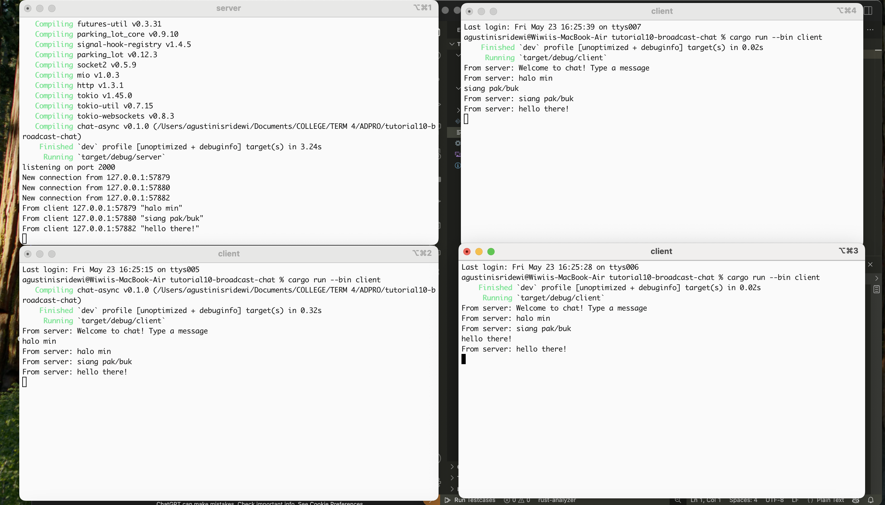
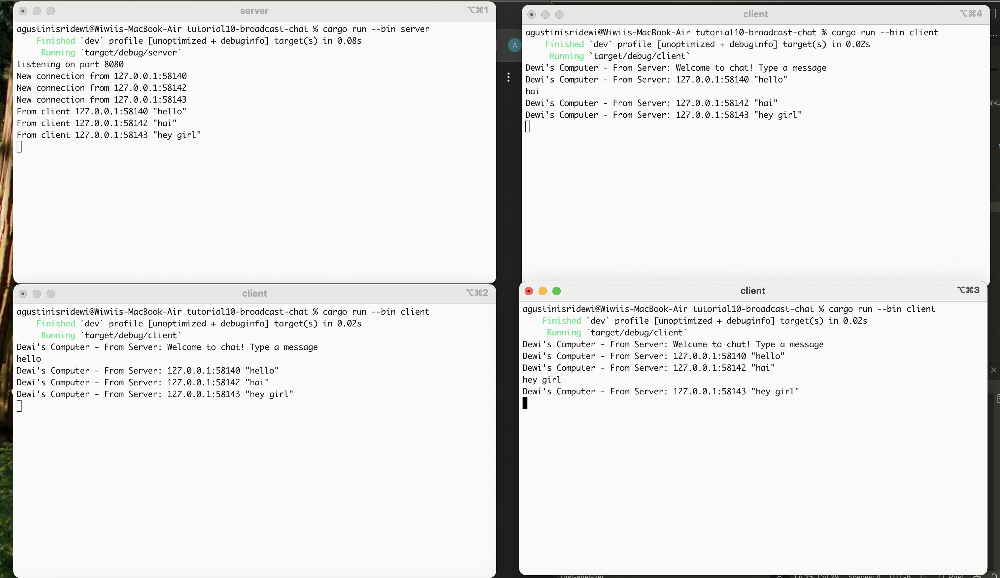

## AdvProg Tutorial 10 Broadcast Chat
Agus Tini Sridewi / 2306276004 / ADPRO A

### 2.1 Original code of the broadcast chat

Cara Menjalankan Program:
1. Buka 4 terminal terpisah untuk menjalankan satu server dan tiga client secara simultan.
2. Arahkan semua terminal ke direktori project tempat kode berada (menggunakan perintah cd).
3. Di terminal pertama, jalankan perintah: `cargo run --bin server`. Ini akan menjalankan server yang bertugas menerima dan mendistribusikan pesan.
4. Di tiga terminal lainnya, jalankan masing-masing perintah: `cargo run --bin client`untuk menjalankan klien yang dapat mengirim dan menerima pesan.

Server dan klien berkomunikasi melalui koneksi TCP. Saat klien mengirim pesan, server menerimanya, mencetaknya di terminal, lalu menyiarkan pesan itu ke semua klien yang terhubung. Klien kemudian menerima pesan dari server dan menampilkannya di terminal mereka. Semua proses berjalan secara asinkron, memungkinkan pertukaran pesan real-time antar banyak klien melalui satu server pusat.

### 2.2 Modifying port
Pada sisi server (server.rs), koneksi dibuat melalui TcpListener yang bind ke 127.0.0.1:8080. Di sisi klien (client.rs), alamat koneksi disesuaikan menggunakan URI ws://127.0.0.1:8080 untuk terhubung ke server lewat protokol WebSocket.

Meskipun server tidak secara eksplisit menyebut protokol WebSocket, ia menggunakannya lewat crate tokio_websockets. Koneksi TCP yang diterima dikonversi menjadi WebSocketStream menggunakan ServerBuilder, yang juga menangani proses handshake secara otomatis saat accept() dipanggil.

Pertukaran data antara server dan klien menggunakan tipe Message dari tokio_websockets, memungkinkan komunikasi teks berbasis WebSocket. Untuk mengirim pesan ke semua klien, server menggunakan sistem broadcast dengan tokio::sync::broadcast.

### 2.3 Small changes: add IP and Port of Sender

Saya memodifikasi server agar setiap pesan yang dibroadcast menyertakan alamat pengirim. Perubahan ini dilakukan dalam fungsi handle_connection di file server.rs. Saat klien terhubung, alamat socket-nya disimpan dalam variabel addr, dan digunakan untuk membentuk pesan broadcast dengan format: `format!("{addr:?} {text:?}")`

Alamat socket ini diperoleh secara otomatis dari koneksi masuk (TcpStream) ketika klien pertama kali tersambung. Setiap koneksi ditangani oleh thread asynchronous terpisah, sehingga server dapat secara akurat melacak dan menyisipkan alamat pengirim ke dalam setiap pesan. Di sisi klien, saya juga menambahkan label identitas komputer dalam tampilan pesan untuk memperjelas sumbernya. 